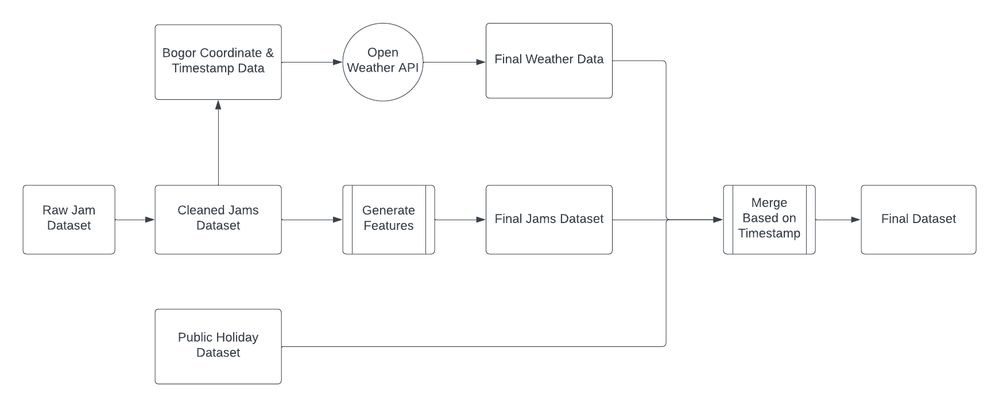
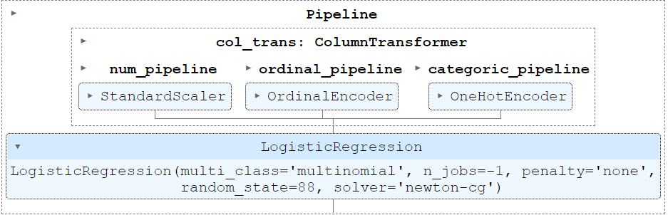
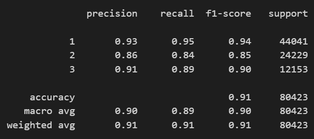

# Data Science Learning Studio 2023 : Data Science Project

Bogor traffic jam prediction based on historical data (Waze) combined with weather data fetch using Open Weather API

## Data Preprocessing Approach

## Final Model Pipeline

## Model Classification Report

## Conclussion

Multiclass logistic classification could be a solution to predict traffic jam in Bogor with F1_score 0.91

## Document Report

[Document Report PPTX](report/DS%20Mini%20Project%20DSLS%202023_Ihsan%20Nur%20Faqih.pptx)

[Jupyter Notebook Modeling](notebook/EDA%20%26%20Modeling%20iter0.ipynb)
